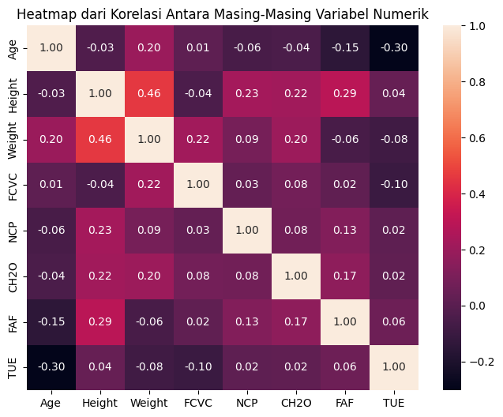
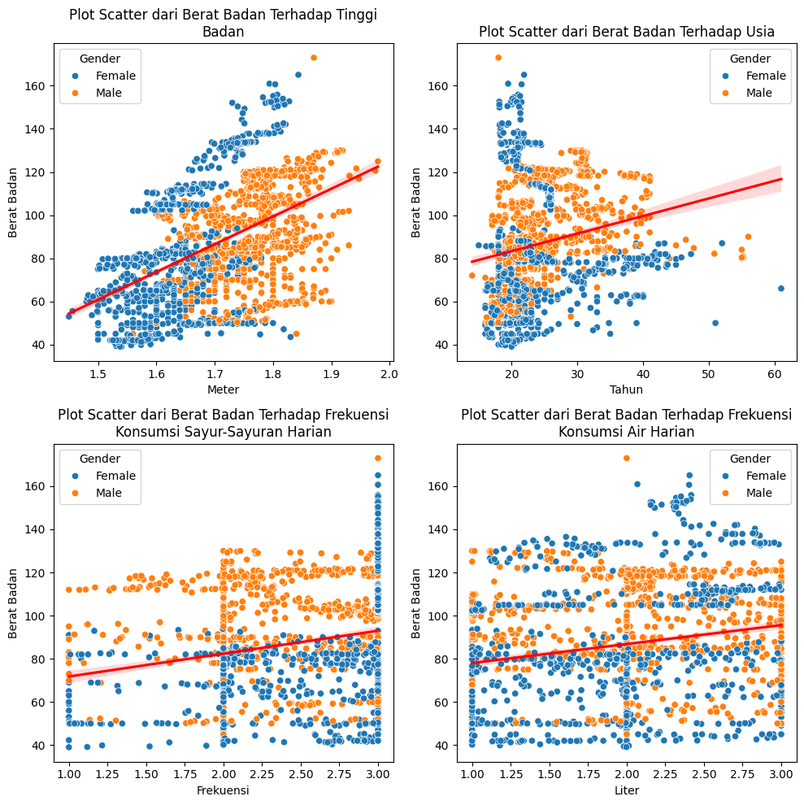

# Laporan Proyek Machine Learning - Marcel Aditya Pamungkas

## Domain Proyek

Obesitas maupun berat badan berlebih merupakan penyakit yang dapat didefinisikan sebagai penumpukan lemak berlebih pada badan seseorang. Obesitas dapat terjadi pada seluruh manusia dari jenis kelamin apapun dan umur berapapun. Menurut World Health Organization (WHO), pada tahun 2022, sekitar 2.5 miliar orang di dunia menderita berat badan berlebih, dengan 890 juta di antaranya dikategorikan sebagai obesitas. Tingkat berat badan seseorang diukur menggunakan *Body Mass Index* (BMI). Obesitas dapat disebabkan oleh beberapa faktor, seperti makan-makanan berkalori tinggi dalam waktu singkat, kurang melakukan aktivitas fisik, perubahan perasaan yang menyebabkan nafsu makan menaik, atau kelainan hormon. Obesitas dapat siklasifikasi menjadi 4, yaitu berat badan berlebih (*overweight*), obesitas tingkat 1, obesitas tingkat 2, dan obesitas tingkat 3. Jika dibiarkan, obesitas dapat mengganggu aktivitas sehari-hari, seperti sulit untuk bergerak maupun beraktivitas berat. Tak hanya itu, obesitas juga berpotensi menimbulkan penyakit lainnya yang berbahaya, seperti Diabetes Mellitus tipe 2, jantung koronen, maupun hipertensi. Tentu akan lebih baik jika obesitas dapat dideteksi sedini mungkin. 

Pada zaman sekarang, teknologi telah berkembang pesat, salah satunya adalah teknologi *machine learning*. Hingga sekarang, *machine learning* telah digunakan ke dalam berbagai bidang, salah satunya bidang kesehatan. Dengan seiringnya perkembangan *machine learning*, sekarang *machine learning* mampu mendeteksi berbagai macam penyakit dengan berbagai parameter maupun faktor yang diberikan, salah satunya adalah mendeteksi obesitas. Oleh karena itu, pada proyek ini, penulis ingin memanfaatkan *machine learning* untuk mendeteksi tingkat berat badan pada seseorang, terutama yang didiagnosis mengalami obesitas agar dapat segera dicegah maupun diobati. Penulis ingin memprediksi penyakit obesitas pada responden menggunakan 4 model, yaitu *Extreme Gradient Boosting* (XGBoost), *Support Vector Machine* (SVM), *K-Nearest Neighbors* (KNN), dan *Random Forest*. Penulis menggunakan dataset dari Kaggle yang dapat diakses pada link [berikut](https://www.kaggle.com/datasets/aravindpcoder/obesity-or-cvd-risk-classifyregressorcluster/data).

## Business Understanding

### Problem Statements
Berdasarkan latar belakang yang telah dipaparkan, berikut rincian permasalahan yang dapat dibahas pada proyek ini.
1. Berapa persentase responden yang mengalami obesitas atau *overweight*?
2. Apakah jenis kelamin yang berbeda memiliki tingkat obesitas yang berbeda?
3. Apa faktor-faktor yang memengaruhi berat badan seseorang?
4. Apakah ada faktor tertentu yang dapat ditemukan untuk suatu tingkat obesitas tertentu?
5. Apa model terbaik yang dapat digunakan untuk memprediksi penyakit obesitas?

### Goals
Berdasarkan problem statements, berikut tujuan yang ingin dicapai pada proyek ini.
1. Mengetahui total persentase responden yang mengalami obesitas atau *overweight*.
2. Mencari perbedaan tingkat obesitas yang ada pada jenis kelamin yang berbeda.
3. Mengetahui faktor-faktor yang memengaruhi berat badan seseorang.
4. Mencari suatu faktor tertentu yang sama pada tingkat obesitas tertentu.
5. Menemukan model terbaik berdasarkan akurasi tertinggi untuk memprediksi penyakit obesitas pada responden.

### Solution Statement
1. Melakukan proses *Exploratory Data Analysis* (EDA) untuk mengetahui total persentase responden yang mengalami obesitas atau *overweight*, mencari perbedaan tingkat obesitas yang ada pada jenis kelamin yang berbeda, mengetahui faktor-faktor yang memengaruhi berat badan seseorang, dan mencari suatu faktor tertentu yang sama pada tingkat obesitas tertentu.
2. Menggunakan 4 model *machine learning* untuk memprediksi penyakit obesitas pada responden, yaitu *Extreme Gradient Boosting* (XGBoost), *Support Vector Machine* (SVM), *K-Nearest Neighbors* (KNN), dan *Random Forest*.
3. Menggunakan confusion matrix dan f1 score pada masing-masing model *machine learning* untuk menemukan model terbaik berdasarkan akurasi tertinggi.

## Data Understanding
Dataset yang digunakan untuk memprediksi tingkat obesitas atau *overweight* pada responden diambil dari platform [kaggle](https://www.kaggle.com/) yang dipublikasikan oleh ARAVINDPCODER dengan usability score 10/10. Data ini didapat dari survei menggunakan platform web kepada orang-orang dari negara Mexico, Peru, dan Colombia, dengan usia di rentang 14 hingga 61 tahun dan dari berbagai jenis kondisi fisik. Dataset ini terdiri dari 1 file csv. 

### Informasi Keterangan Variabel pada Data
Dataset ini memiliki 17 variabel dengan keterangan sebagai berikut.
Variabel | Keterangan
----------|----------
Gender | Jenis kelamin responden (laki-laki atau perempuan)
Age | Usia responden
Height | Tinggi responden (meter)
Weight | Berat responden (kilogram)
family_history_with_overweight | Apakah terdapat anggota keluarga responden yang juga terkena obesitas
FAVC | Apakah responden mengonsumsi makanan berkalori tinggi
FCVC | Frekuensi konsumsi sayur-sayuran dalam sehari
NCP | Frekuensi konsumsi makanan berat dalam sehari
CAEC | Konsumsi makanan di antara makan berat
SMOKE | Apakah responden merupakan perokok 
CH2O | Frekuensi Konsumsi air dalam sehari (liter)
SCC	| Apakah responden memantau asupan kalori
FAF	| Frekuensi aktivitas fisik dalam seminggu (0 = Tidak pernah, 1 = 1-2 hari, 2 = 3-4 hari, 3 = 5-6 hari)
TUE	| Waktu pemakaian gadget dalam sehari (0 = 0-3 jam, 1 = 4-6 jam, 2 = 6+ jam)
CALC | Frekuensi konsumsi alkohol
MTRANS | Jenis transportasi yang digunakan
NObeyesdad | Tingkat berat badan responden

Pada variabel `FAF`, `TUE`, dan `NObeyesdad`, setiap nilai memiliki arti masing-masing. Berikut penjelasannya.

1. Variabel `FAF`

Nilai | Keterangan
----------|----------
0 | Tidak pernah
1 | 1-2 hari
2 | 3-4 hari
3 | 5+ hari

2. Variabel `TUE`

Nilai | Keterangan
----------|----------
0 | 0-3 jam
1 | 4-6 jam
2 | 6+ jam

3. Variabel `NObeyesdad`

Nilai | Arti | BMI
--------|--------|--------
Insufficient_Weight | Kekurangan Berat Badan | < 18.5
Normal_Weight | Berat Badan Normal | 18.5 - 24.9 
Overweight_Level_I | Overweight Tingkat 1 | 25.0 - 27.4
Overweight_Level_II | Overweight Tingkat 2 | 27.5 - 29.9
Obesity_Type_I | Obesitas Tingkat 1 | 30.0 - 34.9
Obesity_Type_II | Obesitas Tingkat 2 | 35.0 - 39.9
Obesity_Type_III | Obesitas Tingkat 3 | > 40

### Data Cleaning
Setelah diperiksa apakah terdapat kolom yang bernilai null, hasilnya adalah tidak ada. Sementara itu, setelah diperiksa apakah terdapat data duplikat, ditemukan 24 duplikat, sehingga data duplikat ini dihapus. Oleh karena itu, setelah dilakukan pembersihan data, diperoleh deskripsi statistik data numerik sebagai berikut. 
| | Age |	Height | Weight | FCVC | NCP | CH2O | FAF | TUE |
----------|----------|----------|----------|----------|----------|----------|----------|----------
count	| 2087.000000 |	2087.000000 |	2087.000000	| 2087.000000 |	2087.000000	| 2087.000000 |	2087.000000 |	2087.000000
mean | 24.353090 | 1.702674 | 86.858730 |	2.421466 | 2.701179 |	2.004749 | 1.012812 |	0.663035
std	| 6.368801 | 0.093186 | 26.190847	| 0.534737 | 0.764614 | 0.608284 | 0.853475 | 0.608153
min	| 14.000000 |	1.450000 | 39.000000 | 1.000000 | 1.000000 | 1.000000	| 0.000000 | 0.000000
25%	| 19.915937	| 1.630178 | 66.000000 | 2.000000 | 2.697467 | 1.590922 | 0.124505 | 0.000000
50%	| 22.847618 |	1.701584 | 83.101100 | 2.396265 |	3.000000 | 2.000000 |	1.000000 | 0.630866
75%	| 26.000000 | 1.769491 | 108.015907 | 3.000000 | 3.000000 | 2.466193 | 1.678102 | 1.000000
max	| 61.000000	| 1.980000 | 173.000000 | 3.000000 | 4.000000 | 3.000000 | 3.000000 | 2.000000

Dari deskripsi data statistik di atas, disimpulkan bahwa responden memiliki rentang usia 14-61 tahun dengan tinggi rentang 1.45-1.98 meter dan berat rentang 39-173 kilogram. Selanjutnya, akan diperiksa apakah terdapat outlier pada data tersebut.

  

Interpretasi:
1. Pada kolom `Age`, dapat dilihat bahwa mayoritas responden berusia di rentang 20-30 tahun. Terdapat beberapa outlier, yaitu usia 50 tahun ke atas. Meski demikian, outlier ini tidak akan dihapus karena sangat memungkinkan seseorang berusia 50 tahun ke atas.
2. Pada kolom `Weight`, dapat dilihat bahwa mayoritas responden memiliki berat badan di rentang 60-110 kilogram. Terdapat 1 outlier, yaitu responden dengan berat badan 173 kilogram. Meski demikian, outlier ini tidak akan dihapus karena sangat memungkinkan seseorang memiliki berat badan 173 kilogram.
3. Pada kolom `Height`, dapat dilihat bahwa mayoritas responden memiliki tinggi badan di rentang 1.6-1.8 meter. Terdapat 1 outlier, yaitu responden dengan tinggi badan 1.98 meter. Meski demikian, outlier ini tidak akan dihapus karena sangat memungkinkan seseorang memiliki tinggi badan 1.98 meter.
4. Pada kolom-kolom lainnya, dapat dilihat bahwa persebaran data merata dan tidak terdapat outlier yang signifikan.

Untuk proses analisis ini, outlier tidak akan dibuang karena sangat memungkinkan responden termasuk dalam outlier tersebut. Data sudah siap untuk diproses dan dianalisis.

### Univariate Analysis

Dari variabel-variabel yang diketahui, variabel dapat dibagi menjadi 2 jenis, yaitu variabel numerikal dan variabel kategorikal. Berikut merupakan kolom-kolom yang termasuk dalam variabel numerikal maupun kategorikal.  
Kolom-kolom numerikal: ['Age', 'Height', 'Weight', 'FCVC', 'NCP', 'CH2O', 'FAF', 'TUE']  
Kolom-kolom kategorikal: ['Gender', 'family_history_with_overweight', 'FAVC', 'CAEC', 'SMOKE', 'SCC', 'CALC', 'MTRANS', 'NObeyesdad']

Pertama, kita akan memvisualisasikan kolom-kolom kategorikal untuk melihat jumlah-jumlah nilai kategorikal menggunakan bar plot.

  

Interpretasi:
1. Dari `Plot Jumlah dari Riwayat Obesitas Dalam Keluarga`, mayoritas responden memiliki riwayat obesitas dalam keluarganya.
2. Dari `Plot Jumlah dari Frekuensi Konsumsi Makanan Berkalori Tinggi`, mayoritas responden memakan makanan berkalori tinggi.
3. Dari `Plot Jumlah dari Konsumsi Makanan Di Antara Makan Berat`, mayoritas responden memakan makanan seperti cemilan atau snacks di antara makan berat.
4. Dari `Plot Jumlah dari Perokok atau Bukan`, mayoritas responden bukan perokok.
5. Dari `Plot Jumlah dari Memantau Asupan Kalori`, mayoritas responden tidak memantau asupan kalori mereka masing-masing.
6. Dari `Plot Jumlah dari Mengonsumsi Alkohol`, sebagian besar responden terkadang minum alkohol dan sebagian kecil responden tidak meminum alkohol.
7. Dari `Plot Jumlah dari Jenis Transportasi yang Digunakan`, mayoritas responden menggunakan transportasi umum sebagai sarana transportasi mereka
8. Dari `Plot Jumlah dari Tingkat Berat Badan`, persebaran tingkat level berat badan cukup merata, dengan Obesitas tingkat 1 merupakan jumlah yang paling banyak dialami responden.

Karena fokus pada analisis adalah mendeteksi penyakit obesitas, maka kita akan melihat lebih detail mengenai `Jumlah dari Tingkat Berat Badan`. Kita akan mencari distribusi persentase tingkat berat badan menggunakan pie chart.

  

Dari gambar di atas, total responden yang mengalami berat badan berlebih maupun obesitas berjumlah $73.7\%$, dengan $46.5\%$ di antaranya mengalami obesitas.

Selanjutnya, kita akan memvisualisasikan kolom-kolom numerikal untuk melihat persebaran nilai menggunakan histogram.

  

Interpretasi:
1. Plot Histogram dari `Konsumsi Air Harian`, `Frekuensi Aktivitas Fisik`, `Lama Pemakaian Gadget` tidak berdistribusi normal.
2. Plot Histogram dari `Tinggi Badan`, `Frekuensi Konsumsi Sayur-Sayuran`, `Frekuensi Konsumsi Makanan Berat` cukup berdistribusi normal.
3. Plot Histogram dari `Usia` dan `Berat Badan` memiliki distribusi data yang miring ke kanan. Artinya, mayoritas data memiliki nilai di bawah rata-rata.

### Multivariate Analysis

#### 1. Membandingkan Tingkat Berat Badan Pada Setiap Jenis Kelamin

  

Interpretasi:
1. Laki-laki lebih banyak memiliki berat badan berlebih tingkat 2 dan obesitas tingkat 1 dibandingkan perempuan.
2. Hampir seluruh obesitas tingkat 2 dialami oleh laki-laki, sedangkan hampir seluruh obesitas tingkat 3 dialami oleh perempuan.

#### 2. Membandingkan Tingkat Berat Badan dengan Usia

  

Interpretasi:
1. Seluruh penyandang obesitas tingkat 3 berusia di bawah 30 tahun.
2. Seluruh penyandang obesitas tingkat 2 berusia di sekitar rentang 20-40 tahun.

#### 3. Membandingkan Tingkat Berat Badan dengan Jumlah Makan Berat

  

Interpretasi:
1. Seluruh penyandang obesitas tingkat 3 makan berat sebanyak 3 kali dalam sehari.
2. Penyandang obesitas tingkat 1 makan berat sebanyak rentang 1-3 kali dalam sehari.
3. Seluruh responden selain poin nomor 1 dan 2 memiliki jumlah makan berat yang bervariasi, dari rentang 1-4 kali makan dalam sehari.

#### 4. Membandingkan Tingkat Berat Badan dengan Jumlah Makan Berat

  

Interpretasi:
Seluruh penyandang obesitas tingkat 2 dan tingkat 3 melakukan aktivitas fisik kurang dari 4 hari dalam seminggu.

#### 5. Membandingkan Tingkat Berat Badan dengan Frekuensi Konsumsi air

  

Interpretasi:
Seluruh responden di setiap tingkat berat badan memiliki frekuensi konsumsi air yang beragam, dengan rentang 1-3 liter dalam sehari.

#### 6. Membandingkan Tingkat Berat Badan dengan Konsumsi Makanan Di Antara Makan Berat

  

Interpretasi:
1. Mayoritas responden baik laki-laki maupun perempuan terkadang makan di antara makanan berat.
2. Responden yang sering atau selalu makan di antara makanan berat memiliki berat badan kurang dari 120 kilogram.
3. Lebih banyak laki-laki yang sering makan di antara makanan berat dan memiliki berat badan di atas 60 kilogram dibandingkan perempuan.

#### 7. Membandingkan Tingkat Berat Badan dengan Jenis Transportasi yang Digunakan

  

Interpretasi:
1. Mayoritas responden menggunakan transportasi umum sebagai sarana transportasi mereka.
2. Seluruh penyandang obesitas tingkat 3 menggunakan transportasi umum sebagai sarana transportasi mereka.

#### 8. Membandingkan Tingkat Berat Badan dengan Frekuensi Konsumsi Alkohol

  

Interpretasi:
1. Mayoritas responden terkadang mengonsumsi alkohol.
2. Seluruh penyandang obesitas tingkat 3 terkadang mengonsumsi alkohol.

#### 9. Melihat Korelasi Variabel dengan Menggunakan Heatmap

  

Interpretasi:

Berat badan responden memiliki
1. Korelasi positif yang cukup kuat dengan tinggi badan.
2. Korelasi positif yang lemah terhadap usia, frekuensi konsumsi sayur-sayuran dalam sehari, dan frekuensi konsumsi air dalam sehari.
3. Korelasi positif yang sangat lemah terhadap frekuensi konsumsi makanan berat.
4. Korelasi negatif yang sangat lemah terhadap frekuensi aktivitas fisik dalam seminggu dan waktu pemakaian gadget dalam sehari.

#### 10. Melihat Plot Scatter yang Memiliki Nilai Korelasi $\geq$ 0.2 dari Berat Badan

  

Interpretasi:

Seperti pada poin nomor 9, berat badan responden memiliki
* Korelasi positif yang cukup kuat dengan tinggi badan karena garis trend mengarah ke arah kanan atas.
* Korelasi positif yang lemah terhadap usia, frekuensi konsumsi sayur-sayuran dalam sehari, dan frekuensi konsumsi air dalam sehari karena garis trend mengarah sedikit ke arah kanan atas.

## Data Preparation
Pertama, akan diubah nilai-nilai kategorikal pada data menggunakan encoder sehingga menjadi nilai-nilai numerik agar dapat dilatih dengan *machine learning*.

### Encoding Kategorikal

Encoding Kategorikal dilakukan terhadap 4 variabel, yaitu
* `family_history_with_overweight` (Apakah terdapat anggota keluarga responden yang juga terkena obesitas)
* `FAVC` (Apakah responden mengonsumsi makanan berkalori tinggi)
* `SMOKE` (Apakah responden merupakan perokok)
* `SCC` (Apakah responden memantau asupan kalori)

karena nilai-nilai pada keempat variabel tersebut hanya `yes` (iya) atau `no` (tidak). Encoding ini dilakukan menggunakan `.map()`dengan cara mengganti nilai `yes` dengan `1`, dan nilai `no` dengan `0`.

### One Hot Encoding

One Hot Encoding dilakukan terhadap 2 variabel, yaitu

* `MTRANS` (Jenis transportasi yang digunakan)
* `Gender` (Jenis kelamin responden)

karena nilai-nilai pada kedua variabel tersebut tidak memiliki urutan tertentu. Encoding ini dilakukan menggunakan `.get_dummies()` dengan cara membuat kolom-kolom baru berdasarkan masing-masing nilai dari variabel tersebut, mengisinya dengan `True` atau `False` sesuai dengan keadaan, lalu menghapus kedua kolom aslinya.

### Encoding Ordinal

Encoding Ordinal dilakukan terhadap 2 variabel, yaitu
* CAEC (Konsumsi makanan di antara makan berat)
* CALC (Frekuensi konsumsi alkohol)

karena nilai-nilai pada kedua variabel tersebut memiliki urutan dengan urutannya adalah `['no', 'Sometimes', 'Frequently', 'Always']`. Encoding ini dilakukan menggunakan `OrdinalEncoder` dari library sklearn dengan cara mengurutkan nilai-nilainya, lalu diganti dengan angka sesuai urutannya.

### Data Training dan Testing

Tahapan ini dilakukan untuk membagi data menjadi 2, yaitu data training dan testing. Data training digunakan untuk melatih model dengan data yang ada, sedangkan data testing digunakan untuk menguji model yang dibuat menggunakan data yang belum dilatih. Pembagian data ini dilakukan dengan perbandingan 80% : 20% untuk data training dan data testing menggunakan `train_test_split` dari library sklearn.

## Modeling

Ada 4 algoritma *Machine Learning* yang digunakan untuk membuat model, yaitu sebagai berikut.
### 1. ***Extreme Gradient Boosting* (XGBoost)**.

Algoritma ini bekerja dengan mengimplementasikan *decision tree* yang kemudian ditingkatkan dengan gradien untuk meningkatkan kecepatan dan kinerja. Kelebihan dari algoritma ini adalah memiliki performa dan efisiensi tinggi, efektif untuk dataset bberukuran besar, dan memiliki parameter regularisasi yang mampu mencegah *overfitting*. Sementara itu, kekurangan dari algoritma ini adalah membutuhkan ketelitian terhadap hyperparameter tuning untuk mencegah *overfitting* dan komputasi yang mahal serta membutuhkan memori yang besar untuk dataset berukuran besar.  

Pada pemodelan ini, XGBoost diimplementasikan menggunakan `XGBClassifier` dari library `xgboost` dengan memasukkan `X_train` dan `y_train` untuk melatih model, lalu menggunakan `X_test` dan `y_test` untuk menguji model dengan data testing yang tidak ada di data training. Parameter yang digunakan pada model ini adalah `max_depth` yaitu kedalaman maksimum setiap tree, `n_estimators` yaitu jumlah tree yang akan dibuat, `random_state` yaitu mengontrol seed acak yang diberikan pada setiap iterasi, `learning rate` yaitu mengatur langkah setiap iterasi ketika meminimumkan *loss function*, dan `n_jobs` yaitu mengatur jumlah CPU threads untuk menjalankan XGBoost. Pada proyek ini, parameter yang digunakan adalah `max_depth = 10`, `n_estimators = 125`, `random_state = 30`, `learning_rate = 0.01`, `n_jobs = 20`.

### 2. ***Support Vector Machine* (SVM)**

Algoritma ini bekerja dengan mencari hyperplane terbaik untuk memisahkan kelas-kelas fitur serta menggunakan fungsi kernel untuk mentransformasikan data ke dimensi yang lebih tinggi agar dapat dipisahkan apabila pemisahan linier tidak memungkinkan. Kelebihan dari algoritma ini adalah efektif untuk dimensi tinggi, penggunaan memori yang efisien, dan dapat menggunakan fungsi kernel apapun. Sedangkan kekurangan dari algoritma ini adalah tidak cocok untuk dataset berukuran besar dan memiliki performa buruk untuk data yang noisy ataupun tidak bersih.  

Pada pemodelan ini, SVM diimplementasikan menggunakan `SVC` dari library `sklearn.svm` dengan memasukkan `X_train` dan `y_train` untuk melatih model, lalu menggunakan `X_test` dan `y_test` untuk menguji model dengan data testing yang tidak ada di data training. Parameter yang digunakan pada model ini adalah `kernel` yaitu tipe kernel yang digunakan untuk mentransformasikan input data, `gamma` yaitu pengaruh dari sebuah contoh training, dan `random_state` yaitu mengontrol seed acak yang diberikan pada setiap iterasi. Pada proyek ini, parameter yang digunakan adalah `kernel = 'rbf'`, `gamma = 'auto'`, `random_state = 50`.

### 3. ***K-Nearest Neighbors* (KNN)**

Algoritma ini bekerja dengan mengklasifikasikan titik data berdasarkan kelas mayoritas dari sejumlah k tetangga terdekatnya. Kelebihan dari algoritma ini adalah mudah dan simple untuk digunakan, tidak ada fase *lazy learning* sehingga cepat, dan efektif untuk dataset berukuran kecil serta untuk masalah multi-class. Sementara itu, kekurangan dari algoritma ini adalah sensitif terhadap pemilihan k dan metrik jarak serta memiliki performa buruk untuk data berdimensi tinggi (*curse of dimensionality*).  

Pada pemodelan ini, KNN diimplementasikan menggunakan `KNeighborsClassifier` dari library `sklearn.neighbors` dengan memasukkan `X_train` dan `y_train` untuk melatih model, lalu menggunakan `X_test` dan `y_test` untuk menguji model dengan data testing yang tidak ada di data training. Parameter yang digunakan pada model ini adalah `n_neighbors` yaitu jumlah k tetangga. Pada proyek ini, parameter yang digunakan adalah `n_neighbors = 7` karena ingin mengklasifikasi tingkat berat badan menjadi 7 sesuai dengan yang ada di data.

### 4. ***Random Forest***

Algoritma ini bekerja dengan membentuk decision trees, lalu menggunakan sampiing dengan penggantian (*bootstrapping*) dan pemilihan fitur acak untuk setiap pohon agar pohon-pohon menjadi beragam. Kelebihan dari algoritma ini adalah memiliki akurasi tinggi karena menggunakan pendekatan ensemble, mencegah *overfitting* dengan jumlah pohon yang banyak, dan mampu menangani dataset berukuran besar dan multi dimensi. Sedangkan kekurangan dari algoritma ini adalah komputasi yang besar untuk jumlah pohon yang besar dan membutuhkan memori yang besar untuk menyimpan seluruh pohon.  

Pada pemodelan ini, *Random Forest* diimplementasikan menggunakan `RandomForestClassifier` dari library `sklearn.ensemble` dengan memasukkan `X_train` dan `y_train` untuk melatih model, lalu menggunakan `X_test` dan `y_test` untuk menguji model dengan data testing yang tidak ada di data training. Parameter yang digunakan pada model ini adalah `n_estimators` yaitu jumlah tree yang akan dibuat, `criterion` yaitu fungsi untuk menentukan kualitas *splitting data*, `max_depth` yaitu kedalaman maksimum setiap tree, dan `random_state` yaitu mengontrol seed acak yang diberikan pada setiap iterasi. Pada proyek ini, parameter yang digunakan adalah `n_estimators = 200`, `criterion = "entropy"`, `max_depth = 10`, `random_state = 50`.

### 5. Pemilihan Model

Setelah semua model dijalankan, penulis memilih algoritma *Random Forest* sebagai model terbaik yang akan digunakan sebagai solusi untuk memprediksi obesitas karena model ini memiliki akurasi dan skor f1 tertinggi dibandingkan model lainnya, serta kesalahan klasifikasi pada matriks confusion yang lebih kecil dibanding model lainnya. Penjelasan lebih lengkap mengenai alasan ini ada di bagian selanjutnya, yaitu **evaluation**.

## Evaluation

Pada proyek ini, penilaian model menggunakan confusion matrix, akurasi, dan f1 score sebagai metrik evaluasi untuk masing-masing model. Akan dijelaskan terlebih dahulu bagaimana cara mendapatkan akurasi dan f1 score serta bagaimana cara menggunakan confusion matrix.

### Sekilas Tentang Matriks Confusion, Akurasi, dan Skor f1

Matriks Confusion merupakan sebuah tabel untuk mengukur akurasi dari model klasifikasi. Contoh dari Matriks Confusion beserta labelnya dapat dilihat pada gambar di bawah ini. 

  

Setiap baris pada matriks confusion merepresentasikan nilai sesungguhnya, sedangkan setiap kolom pada matriks confusion merepresentasikan nilai yang diprediksi. Terdapat 4 label pada matriks confusion seperti yang terlihat di gambar, yaitu TP, TN, FP, dan FN.
1. *True Positive* (TP) merupakan jumlah data pada positif yang ditebak dengan benar.
2. *True Negative* (TN) merupakan jumlah data pada negatif yang ditebak dengan benar.
3. *False Positive* (FP) merupakan jumlah data yang ditebak dengan salah karena diprediksi positif, sedangkan aslinya adalah negatif. Kesalahan ini sering disebut Error Tipe 1.
4. *False Negative* (FN) merupakan jumlah data yang ditebak dengan salah karena diprediksi negatif, sedangkan aslinya adalah positif. Kesalahan ini sering disebut Error Tipe 2.

Selanjutnya, metrik evaluasi yang digunakan berdasarkan label-label yang diketahui dari matriks confusion ada 4, yaitu sebagai berikut.
1. Akurasi (*Accuracy*) merupakan proporsi data yang berhasil diprediksi dengan benar dari keseluruhan data yang diprediksi. Akurasi dirumuskan sebagai  

2. 

## Referensi
1. WHO. (2024). Diakses pada 6 Juli 2024 dari https://www.who.int/news-room/fact-sheets/detail/obesity-and-overweight
2. Kułak, Klaudia Brygida, Izabela Magdalena Sztybór & Katarzyna Kamińska. "OBESITY - AN EPIDEMIC OF THE 21ST CENTURY – LITERATURE REVIEW", 2024, p. 1-10. Journal of Education, Health and Sport, diakses pada 7 Juli 2024.
3. Dicoding. Diakses pada 6 Juli 2024 dari https://www.dicoding.com/academies/319-machine-learning-terapan
4. Tim Promkes RSST - RSUP dr. Soeradji Tirtonegoro Klaten. (2022). Diakses pada 6 Juli 2024 dari https://yankes.kemkes.go.id/view_artikel/429/obesitas
5. Tandiono, Steven Marcelino & Samuel Ady SanjayaWise. "Machine Learning Approach of ObesityLevel Classification: A Systematic Literature Reviewof Methods and Factors", vol. 8, no. 1, 2023, p. 196-208. G-Tech : Jurnal Teknologi Terapan, diakses pada 7 Juli 2024.
